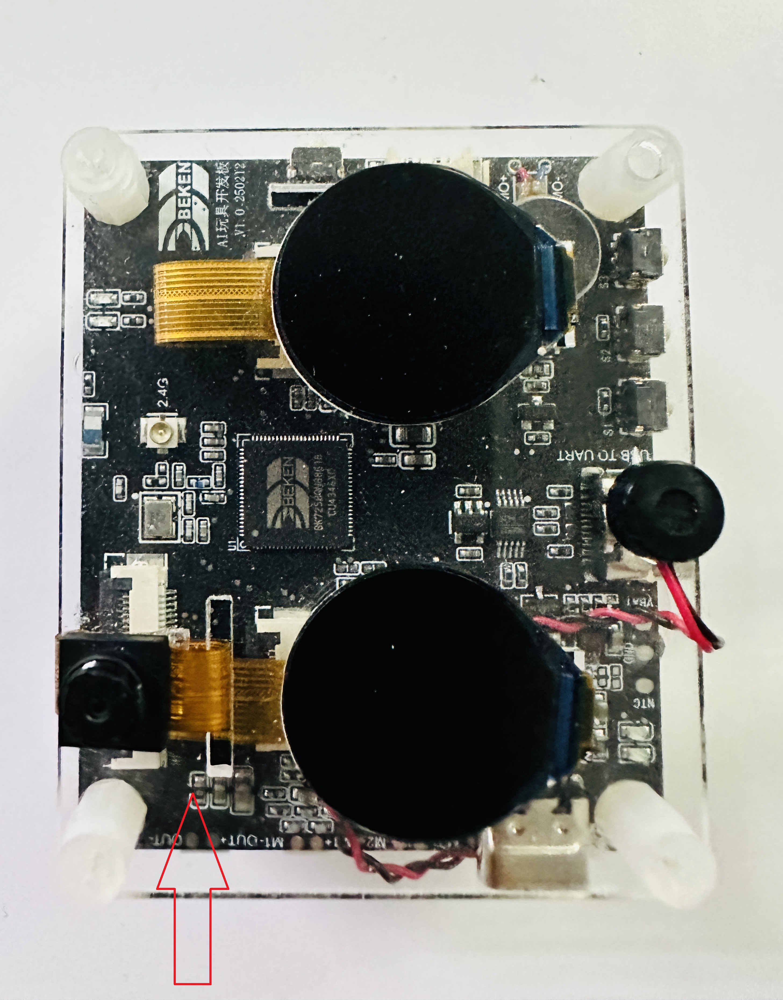

Rock Paper Scissors
=================================

:link_to_translation:`zh_CN:[中文]`

1. Introduction
---------------------------------

This project is a rock-paper-scissors game demo implemented based on an open-source gesture detection model and the TensorFlow Lite Micro lightweight deep learning framework. It captures gesture images through a DVP camera, uses TensorFlow Lite Micro to perform AI inference on CPU1 to recognize gestures, then battles against system-generated random gestures, and finally displays the match results on dual LCD screens with voice announcements.

1.1 System Architecture
,,,,,,,,,,,,,,,,,,,,,,,,,,,,,,,,,

* **Dual-Core Architecture**:
  
  * CPU0: Runs WiFi, Bluetooth
  * CPU1: Runs multimedia, TensorFlow Lite Micro AI inference tasks (480MHz)

* **AI Processing Flow**:
  
  * Image Capture → Preprocessing → TensorFlow Inference → Post-processing → Result Output

1.2 Hardware Configuration
,,,,,,,,,,,,,,,,,,,,,,,,,,,,,,,,,

* SPI LCD X2 (GC9D01) - Dual screen display
* DVP Camera (GC2145) - Image capture
* Microphone - Voice input
* Speaker - Voice announcement
* SD NAND 128MB - Storage resources
* NFC (MFRC522) - Near field communication
* Gyroscope (SC7A20H) - Attitude detection
* Charging Management Chip (ETA3422)
* Lithium Battery

2. Project Structure
---------------------------------

2.1 Directory Organization
,,,,,,,,,,,,,,,,,,,,,,,,,,,,,,,,,

::

    rock_paper_scissors/
    ├── main/
    │   ├── app_cpu0_main.c           # CPU0 main program
    │   ├── app_cpu1_main.c           # CPU1 entry
    │   ├── app_main_cpu1.cc          # CPU1 TensorFlow task
    │   ├── tflite/                   # TensorFlow Lite code
    │   │   ├── main_functions.cc     # Inference main logic
    │   │   ├── gesture_detection_model_data.cc  # Model data
    │   │   ├── image_provider.cc     # Image input interface
    │   │   ├── detection_responder.cc # Result processing
    │   │   └── model_settings.h      # Model configuration
    │   ├── media/                    # Media processing
    │   │   ├── media_main.c          # Media main control
    │   │   ├── media_audio.c         # Audio processing
    │   │   └── resource/             # Voice resources
    │   ├── display/                  # Display control
    │   │   ├── lvgl_app.c            # LVGL application
    │   │   └── lv_*.c                # Display interfaces
    │   └── CMakeLists.txt            # Build configuration
    ├── config/                       # Chip configuration
    └── CMakeLists.txt                # Project build

2.2 Key Components
,,,,,,,,,,,,,,,,,,,,,,,,,,,,,,,,,

* **bk_tflite_micro**: TensorFlow Lite Micro component
* **multimedia**: Multimedia processing
* **lvgl**: Graphics library
* **audio_play**: Audio playback
* **media_service**: Media service

3. TensorFlow Lite Micro Code Implementation
---------------------------------

3.1 Model Configuration
,,,,,,,,,,,,,,,,,,,,,,,,,,,,,,,,,

**Model Parameters** (``model_settings.h``):

.. code-block:: cpp

    // Input image dimensions
    constexpr int kNumCols = 192;      // Width
    constexpr int kNumRows = 192;      // Height
    constexpr int kNumChannels = 3;    // RGB channels
    
    // Output categories
    constexpr int kCategoryCount = 2;
    
    // Maximum image size
    constexpr int kMaxImageSize = kNumCols * kNumRows * kNumChannels;

3.2 Model Initialization
,,,,,,,,,,,,,,,,,,,,,,,,,,,,,,,,,

**CPU1 Initialization Flow** (``app_main_cpu1.cc``):

.. code-block:: cpp

    extern "C" void app_main_cpu1(void *arg) {
        // 1. Set CPU frequency to 480MHz
        bk_pm_module_vote_cpu_freq(PM_DEV_ID_LIN, PM_CPU_FRQ_480M);
        
        // 2. Create TensorFlow inference task
        xTaskCreate(tflite_task, "test", 1024*16, NULL, 3, NULL);
        
        // 3. CPU1 main loop
        while (1) {
            vTaskDelay(pdMS_TO_TICKS(1000));
        }
    }

**TensorFlow Task Initialization**:

.. code-block:: cpp

    void tflite_task(void *arg) {
        // 1. Register debug log callback
        RegisterDebugLogCallback(debugLogCallback);
        
        // 2. Allocate model data buffer from PSRAM
        data_ptr = (unsigned char*)psram_malloc(
            g_gesture_detection_model_data_len);
        
        if (data_ptr == NULL) {
            os_printf("===data buffer malloc error====\r\n");
            return;
        }
        
        // 3. Copy model data to PSRAM
        os_memcpy(data_ptr, g_gesture_detection_model_data, 
                  g_gesture_detection_model_data_len);
        
        // 4. Call setup to initialize model
        setup();
        
        // 5. Inference loop
        while (1) {
            loop();  // Execute one inference
            vTaskDelay(pdMS_TO_TICKS(5000));
        }
    }

3.3 Model Loading
,,,,,,,,,,,,,,,,,,,,,,,,,,,,,,,,,

**Setup Function Implementation** (``main_functions.cc``):

.. code-block:: cpp

    void setup() {
        // 1. Initialize target platform
        tflite::InitializeTarget();
        
        // 2. Load model
        model = tflite::GetModel(data_ptr);
        
        // 3. Verify model version
        if (model->version() != TFLITE_SCHEMA_VERSION) {
            MicroPrintf("Model schema version mismatch!\r\n");
            return;
        }
        
        // 4. Create operator resolver (13 operators)
        static tflite::MicroMutableOpResolver<13> micro_op_resolver;
        micro_op_resolver.AddConv2D(tflite::Register_CONV_2D_INT8());
        micro_op_resolver.AddPad();
        micro_op_resolver.AddMaxPool2D();
        micro_op_resolver.AddAdd();
        micro_op_resolver.AddQuantize();
        micro_op_resolver.AddConcatenation();
        micro_op_resolver.AddReshape();
        micro_op_resolver.AddPadV2();
        micro_op_resolver.AddResizeNearestNeighbor();
        micro_op_resolver.AddLogistic();
        micro_op_resolver.AddTranspose();
        micro_op_resolver.AddSplitV();
        micro_op_resolver.AddMul();
        
        // 5. Allocate Tensor Arena from PSRAM (360KB)
        uint8_t *tensor_arena = (uint8_t *)psram_malloc(360 * 1024);
        if (tensor_arena == NULL) {
            MicroPrintf("Tensor arena allocation failed\r\n");
            return;
        }
        
        // 6. Create interpreter
        static tflite::MicroInterpreter static_interpreter(
            model, micro_op_resolver, tensor_arena, 360 * 1024);
        interpreter = &static_interpreter;
        
        // 7. Allocate tensor memory
        TfLiteStatus allocate_status = interpreter->AllocateTensors();
        if (allocate_status != kTfLiteOk) {
            MicroPrintf("AllocateTensors() failed\r\n");
            return;
        }
        
        // 8. Get input tensor
        input = interpreter->input(0);
    }

3.4 Inference Execution
,,,,,,,,,,,,,,,,,,,,,,,,,,,,,,,,,

**Loop Function Implementation**:

.. code-block:: cpp

    void loop() {
        TfLiteTensor* output = NULL;
        uint64_t before, after;
        
        // 1. Get camera image
        MicroPrintf("======Start detecting gesture======\r\n");
        before = (uint64_t)rtos_get_time();
        
        if (kTfLiteOk != GetImage(kNumCols, kNumRows, kNumChannels, 
                                  input->data.int8, 0)) {
            MicroPrintf("Image capture failed.\r\n");
            return;
        }
        
        // 2. Execute model inference
        if (kTfLiteOk != interpreter->Invoke()) {
            MicroPrintf("Invoke failed.\r\n");
            return;
        }
        
        // 3. Get output tensor and quantization parameters
        output = interpreter->output(0);
        g_scale = output->params.scale;
        g_zero_point = output->params.zero_point;
        
        // 4. Post-process to parse results
        uint8_t result = GESTURE_MAX;
        post_process(output->data.int8, &result);
        
        // 5. Calculate inference time
        after = (uint64_t)rtos_get_time();
        MicroPrintf("Detection time: %d ms\r\n", (uint32_t)(after - before));
    }

3.5 Result Post-processing
,,,,,,,,,,,,,,,,,,,,,,,,,,,,,,,,,

**Gesture Recognition Post-processing**:

.. code-block:: cpp

    uint8_t post_process(int8_t *out_data, uint8_t *result) {
        *result = GESTURE_MAX;
        
        // Iterate through 2268 detection boxes
        for(int i = 0; i < 2268; i++) {
            // 1. Dequantize confidence score
            float score = (out_data[i*8 + 4] - g_zero_point) * g_scale;
            
            // 2. Filter by confidence threshold (>62)
            if(score > 62) {
                // 3. Dequantize bounding box coordinates
                int x = (out_data[i*8 + 0] - g_zero_point) * g_scale;
                int y = (out_data[i*8 + 1] - g_zero_point) * g_scale;
                int w = (out_data[i*8 + 2] - g_zero_point) * g_scale;
                int h = (out_data[i*8 + 3] - g_zero_point) * g_scale;
                
                // 4. Dequantize gesture category scores
                float paper = (out_data[i*8 + 5] - g_zero_point) * g_scale;
                float rock = (out_data[i*8 + 6] - g_zero_point) * g_scale;
                float scissors = (out_data[i*8 + 7] - g_zero_point) * g_scale;
                
                // 5. Determine gesture type (threshold >90)
                if (paper > 90) {
                    MicroPrintf("Paper detected!\r\n");
                    *result = GESTURE_PAPER;
                } else if (rock > 90) {
                    MicroPrintf("Rock detected!\r\n");
                    *result = GESTURE_ROCK;
                } else if (scissors > 90) {
                    MicroPrintf("Scissors detected!\r\n");
                    *result = GESTURE_SCISSORS;
                }
                
                break;  // Only process first high-confidence detection
            }
        }
        
        return 0;
    }

3.6 Image Input Interface
,,,,,,,,,,,,,,,,,,,,,,,,,,,,,,,,,

**GetImage Function** (``image_provider.cc``):

Get input data from camera or pre-stored images and convert to INT8 format:

.. code-block:: cpp

    TfLiteStatus GetImage(int image_width, int image_height,
                         int channels, int8_t* image_data, int index) {
        // 1. Get image from camera or cache
        // 2. Convert to 192x192x3 INT8 format
        // 3. Fill into image_data buffer
        return kTfLiteOk;
    }

3.7 External Call Interface
,,,,,,,,,,,,,,,,,,,,,,,,,,,,,,,,,

Provide C interface for other modules:

.. code-block:: cpp

    // Initialization interface
    extern "C" void tflite_task_init_c(void *arg) {
        bk_pm_module_vote_cpu_freq(PM_DEV_ID_LIN, PM_CPU_FRQ_480M);
        RegisterDebugLogCallback(debugLogCallback);
        
        data_ptr = (unsigned char*)psram_malloc(
            g_gesture_detection_model_data_len);
        os_memcpy(data_ptr, g_gesture_detection_model_data, 
                  g_gesture_detection_model_data_len);
        
        setup();
    }
    
    // Processing interface
    extern "C" void tflite_process(uint8_t *data, uint32_t len, 
                                   uint8_t *result) {
        process_pic(data, len, result);
    }

4. Testing Instructions
---------------------------------

4.1 Gesture Direction
,,,,,,,,,,,,,,,,,,,,,,,,,,,,,,,,,

During testing, gesture should be oriented as shown in the figure, and positioned approximately 50cm above the camera.

    Figure 1. Rock_Paper_Scissors Gesture Direction

4.2 Test Steps
,,,,,,,,,,,,,,,,,,,,,,,,,,,,,,,,,

1. **Preparation Phase**
   
   * After power-on, you'll hear voice announcement "Get ready"
   * Position gesture facing the camera
   * Hold gesture steady until voice prompts "Put your hand down"

2. **Detection Phase**
   
   * DVP camera captures 192x192 image
   * CPU1 executes TensorFlow Lite inference (approximately 200-400ms)
   * System recognizes gesture type

3. **Result Display**
   
   * If detection succeeds:
     
     - Dual LCD screens display gestures from both sides
     - Voice announces battle result (win/lose/draw)
   
   * If detection fails:
     
     - Voice prompts "Detection failed"
     - Can retry

4.3 Debug Information
,,,,,,,,,,,,,,,,,,,,,,,,,,,,,,,,,

View inference logs through serial port (115200 baud):

.. code-block:: text

    ======Start detecting gesture======
    Paper detected!
    Detection time: 285 ms

5. References
---------------------------------

* **TensorFlow Lite Micro Developer Guide**: :doc:`../../api-reference/tensorflow`
* **Model Training**: Based on YOLO object detection architecture
* **Component Source**: ``components/bk_tflite_micro/``
* **Example Project**: ``projects/rock_paper_scissors/``
