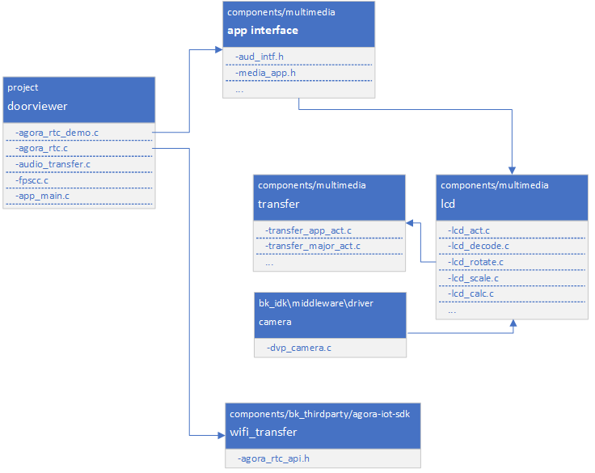

Beken Genie AI
=================================

:link_to_translation:`en:[English]`

1. 简介
---------------------------------

    本工程是基于，端对云，云对大模型的设计方案。

    支持双屏显示，提供视觉加语音的陪伴体验和情绪价值。

    支持端侧打通，各种通用大模型的设计方案，直接对接Open AI、豆包、DeepSeek等。

    并且能够有效，利用云的分布式部署，降低网络延迟，提高交互体验。

    支持端侧AEC，NS等音频处理算法，支持G711/G722编码格式，支持KWS关键字打断唤醒。

    包含常用外设的参考设计以及Demo，比如，陀螺仪，NFC，按键，震动马达，Nand Flash，LED灯效，充电管理，DVP camera，双QPSI屏。

1.1 规格
,,,,,,,,,,,,,,,,,,,,,,,,,,,,,,,,,

    * 硬件配置：
        * SPI LCD X2 (GC9D01)
        * 麦克
        * 喇叭
        * SD NAND 60MB
        * NFC (MFRC522)
        * 陀螺仪 (SC7A20H)
        * 充电管理芯片 (ETA3422)
        * 锂电池
        * DVP (gc2145)

    * 软件特性：
        * AEC
        * NS
        * G722 / G711u
        * 唤醒词定制
        * WIFI Station
        * BLE
        * BT PAN

.. figure:: ../../../_static/beken_genie_pic.jpg
    :align: center
    :alt: Hardware Development Board
    :figclass: align-center

    Figure 1. Hardware Development Board

1.2 按键
,,,,,,,,,,,,,,,,,,,,,,,,,,,,,,,,,

喇叭音量控制:

    1.调大音量
        - 单击 ``S1`` 按钮调大音量

    2.调小音量
        - 单击 ``S2`` 按钮调小音量

1.3 灯效
,,,,,,,,,,,,,,,,,,,,,,,,,,,,,,,,,

1.4 唤醒词
,,,,,,,,,,,,,,,,,,,,,,,,,,,,,,,,,

    1. ``Hi Armino`` 用于唤醒，本地端侧和云端AI互动，同时LCD亮起，展示眼睛动画。

        响应词为 ``A Ha``

    2. ``byebye armino`` 用于关闭，本地端侧和云端AI互动，同时关闭LCD，眼睛动画不再展示。

        响应词为 ``Byebye``

2. 开发指南
---------------------------------

2.1 模块架构图
,,,,,,,,,,,,,,,,,,,,,,,,,,,,,,,,,

    此AI demo方案和门锁方案类似，设备端和和AI大模型端双向语音通话，同时设备端向AI大模型端单向图传，门锁方案中的对端apk变为了AI Agent机器人。
	软件模块架构如下图所示：

.. figure:: ../../../_static/agora_wanson_ai_arch.png
    :align: center
    :alt: module architecture Overview
    :figclass: align-center

    Figure 2. software module architecture

..

    * 方案中，设备端采集mic语音，通过agora sdk将语音数据发送至声网服务器，声网服务器负责和AI Agent大模型的交互，将mic语音发送至AI Agent并获取回复，再将语音回复发送至设备端喇叭播放。
    * 方案中，设备端采集图像，通过agora sdk将每帧图像发送至声网服务器，声网服务器再将图像送至AI Agent大模型进行识别。

2.2 函数关系图
,,,,,,,,,,,,,,,,,,,,,,,,,,,,,,,,,

    如下图所示，方案使用的多媒体的接口，都定义在 **media_app.h** 和 **aud_intf.h** 中。

    Figure 3. module relationship diagram

2.3 工作状态机
,,,,,,,,,,,,,,,,,,,,,,,,,,,,,,,,,

.. figure:: ../../../_static/bk_genie_statemachine.png
    :align: center
    :alt: State Machine Overview
    :figclass: align-center

    Figure 4. module state diagram

::

    1/2 Green light stays on.
    3/4/5 Green and red lights flash alternately
    6/7 Green light flashes quickly.
    8 Green light flashes quickly.
    9 LCD on, LED off.
    10 LCD off
    13/14/15 Red light flashes quickly

2.4 主要配置
---------------------------------

	打开声网功能库需要在 ``cpu0`` 上打开以下配置:

    +----------------------------------------+----------------+---------------+----------------+
    |Kconfig                                 |   CPU          |   Format      |      Value     |
    +----------------------------------------+----------------+---------------+----------------+
    |CONFIG_AGORA_IOT_SDK                    |   CPU0         |   bool        |        y       |
    +----------------------------------------+----------------+---------------+----------------+

    打开Beken配网及agent启动需要在 ``cpu0`` 上打开以下配置:

    +----------------------------------------+----------------+---------------+----------------+
    |Kconfig                                 |   CPU          |   Format      |      Value     |
    +----------------------------------------+----------------+---------------+----------------+
    |CONFIG_NETWORK_AUTO_RECONNECT           |   CPU0         |   bool        |        y       |
    +----------------------------------------+----------------+---------------+----------------+

3. 演示说明
---------------------------------

3.1 代码下载及编译
,,,,,,,,,,,,,,,,,,,,,,,,,,,,,,,,,

    * `AIDK 代码下载 <../../get-started/index.html#armino-aidk-sdk>`_

    * `SDK 构建环境搭建 <https://docs.bekencorp.com/arminodoc/bk_idk/bk7258/zh_CN/v2.0.1/get-started/index.html>`_

    * 代码编译: ``make bk7258 PROJECT=beken_genie``

        * 在源代码根目录下编译
        * 工程目录位于``<source code>/project/beken_genie``

    * `代码烧录 <https://docs.bekencorp.com/arminodoc/bk_idk/bk7258/zh_CN/v2.0.1/get-started/index.html>`_

        * 烧录的二进制文件位于``<source code>/build/beken_genie/bk7258/all-app.bin``

3.2 UI资源格式调整
,,,,,,,,,,,,,,,,,,,,,,,,,,,,,,,,,

    - 1、将要使用的avi视频文件通过SDK中的 ``<bk_aidk源代码路径>/bk_avdk/components/multimedia/tools/aviconvert/bk_avi.7z`` 转换工具进行格式转换，具体使用方法可参考工具中的readme.txt说明

    - 2、将转换后的文件重新放进SD NAND中，并修改为只包含英文或数字的名称

    - 3、修改 ``<bk_aidk源代码路径>/project/beken_genie/main/av_play/avi_play.c`` 文件中传入函数 ``AVI_open_input_file("/genie_eye.avi", 1)`` 的文件名。

3.3 APP注册和下载
,,,,,,,,,,,,,,,,,,,,,,,,,,,,,,,,,

    APP下载：https://docs.bekencorp.com/arminodoc/bk_app/app/zh_CN/v2.0.1/app_download/index.html

    注册登录：使用邮箱注册登录

3.4 固件烧录和资源文件烧录
,,,,,,,,,,,,,,,,,,,,,,,,,,,,,,,,,

    - 1、将要播放的avi视频文件存放到SD NAND中，SD NAND具体使用方法可参考 `Nand磁盘使用注意事项 <../../api-reference/nand_disk_note.html>`_

    - 2、将SDK中的 ``<bk_aidk源代码路径>/project/beken_genie/main/resource/genie_eye.avi`` 文件存放到SD NAND中

    - 3、烧录编译好的all-app.bin文件并上电执行即可。

3.5 操作步骤
,,,,,,,,,,,,,,,,,,,,,,,,,,,,,,,,,

3.5.1 Beken App配网方式
+++++++++++++++++++++++++++++++++

    a)手机进入如下界面，按照图片步骤操作

    .. figure:: ../../../_static/add_ai_device_1.png
        :scale: 30%

    .. figure:: ../../../_static/add_ai_device_2.png
        :scale: 30%

    .. figure:: ../../../_static/add_ai_device_3.png
        :scale: 30%

    .. figure:: ../../../_static/add_ai_device_4.png
        :scale: 30%

    b)手机开始BLE扫描后，长按下图配网键3s，板子进入配网模式

    .. figure:: ../../../_static/add_ai_device_8.png
        :scale: 70%

    c)手机端扫到如下设备，点击设备开始配网

    .. figure:: ../../../_static/add_ai_device_5.png
        :scale: 30%

    .. figure:: ../../../_static/add_ai_device_6.png
        :scale: 30%

    .. figure:: ../../../_static/add_ai_device_7.png
        :scale: 30%

    d)对着板子说“hi armino”后，就可以开启和AI的对话。

      对着板子说“byebye armino”后，可以结束和AI的对话。

3.5.1 命令行方式
+++++++++++++++++++++++++++++++++

1.在PC端打开Agora AI Agent
     - PC端发送post指令启动Agora AI Agent  参考 `Beken AI Agent启动文档 <../../thirdparty/agora/index.html#ai-agent>`_

     可以参考如下格式，appid、restful_key及xxx需要客户自行填写

.. code::

    curl --location --request POST 'https://api.agora.io/api/conversational-ai-agent/v2/projects/{appid}/join' --header 'Content-Type: application/json' --header 'Authorization: Basic {restful_key}' --data-raw '{
        "name": "channel_name",
        "properties": {
            "channel": "channel_name",
            "token": "xxx",
            "agent_rtc_uid": "1234",
            "remote_rtc_uids": [
                "123"
            ],
            "advanced_features": {
                "enable_bhvs": true,
                "enable_aivad": false
            },
            "parameters": {
                "enable_dump": true,
                "output_audio_codec": "G722"
            },
            "enable_string_uid": false,
            "idle_timeout": 0,
            "llm": {
                "url": "xxx",
                "api_key": "xxx",
                "system_messages": [
                {
                    "role": "system",
                    "content": "You are a helpful chatbot."
                }
                ],
                "max_history": 10,
                "greeting_message": "Merry Christmas, how can I assist you today?",
                "failure_message": "I am sorry!",
                "params": {
                    "model": "gpt-4o-mini"
                }
            },
            "tts": {
                "vendor": "bytedance",
                "params": {
                    "token": "xxx",
                    "app_id": "xxx",
                    "cluster": "volcano_tts",
                    "speed_ratio": 1.0,
                    "volume_ratio": 10.0,
                    "pitch_ratio": 1.0,
                    "emotion": "happy"
                }
            },
            "asr": {
                "language": "zh-CN",
                "vendor": "tencent"
            }
        }
    }'

2.设备端wifi连接
	 - demo板发送指令 ``sta test xxxxxx`` 连接2.4GHz名为test的热点

3.启动设备端进入AI对话频道
	 - demo板发送指令 ``agora_test start appid 0 channel_name`` 加入指定的AI对话频道并打开音频通路

        其中appid和channel_name需要替换成实际值，参考 `Beken声网注册文档 <../../thirdparty/agora/index.html#id1>`_

4.唤醒设备端，进行AI对话
	 - 对板载mic说唤醒词 ``hi armino`` ，设备唤醒后会播放提示音 ``啊哈`` ，然后可以进行AI对话

5.退出设备端与AI的对话
	 - 对板载mic说关键词词 ``byebye armino`` ，设备检测到后会播放提示音 ``byebye`` ，然后进入睡眠，停止与AI的对话

6.设备端离开AI对话频道
	 - demo板发送指令 ``agora_test stop`` 离开AI对话频道并关闭音频通路

4. 调试命令
---------------------------------
.. warning::

    调试命令章节，阅读须知：

    调试命令，仅适合对代码有一定理解的开发人员使用。

    如果对代码和流程不熟悉，建议先按照以下演示步骤，熟悉和理解代码后，再酌情考虑。

..

4.1 命令列表:
,,,,,,,,,,,,,,,,,,,,,,,,,,,,,,,,,

    +-------------------------------------------------------+-------------------------------------+
    |Command                                                |Description                          |
    +-------------------------------------------------------+-------------------------------------+
    |agora_test {start|stop appid video_en channel_name}    | 语音通话+识图                       |
    +-------------------------------------------------------+-------------------------------------+

4.2 Start命令
,,,,,,,,,,,,,,,,,,,,,,,,,,,,,,,,,

    +----------------+--------+-------------------------------------------------+
    |agora_test      |  必填  | 命令                                            |
    +----------------+--------+-------------------------------------------------+
    |start           |  必填  | 参数，使能连接RTC Channel                       |
    +----------------+--------+-------------------------------------------------+
    |appid           |  必填  | 参数，声网的APPID                               |
    +----------------+--------+-------------------------------------------------+
    |video_en        |  必填  | 参数，识图功能开关:                             |
    |                |        |   - 1: ``打开``                                 |
    |                |        |   - 0: ``关闭``                                 |
    +----------------+--------+-------------------------------------------------+
    |channel_name    |  必填  | 参数，频道名                                    |
    +----------------+--------+-------------------------------------------------+

.. note::

    使用此命令前需要在PC端自行启动AI Agent

    - 1、在声网官网注册，并获取以下参数 `Beken声网注册文档 <../../thirdparty/agora/index.html#id1>`_

        * AGORA_APPID
        * AGORA_RESTFUL_TOKEN

    - 2、根据Agora AI Agent提供的操作手册，启动服务端的AI Agent。

        a.目前采用PC端启动Agora AI Agent的方式，POST指令请参考声网提供的使用手册 ``<bk_aidk源代码路径>/docs/thirdparty/agora_ai_agent``

        b.也可以参考 `Beken AI Agent启动文档 <../../thirdparty/agora/index.html#ai-agent>`_

4.2 Stop命令
,,,,,,,,,,,,,,,,,,,,,,,,,,,,,,,,,

    +----------------+--------+-------------------------------------------------+
    |agora_test      |  必填  | 命令                                            |
    +----------------+--------+-------------------------------------------------+
    |stop            |  必填  | 参数，关闭当前RTC Channel连接                   |
    +----------------+--------+-------------------------------------------------+